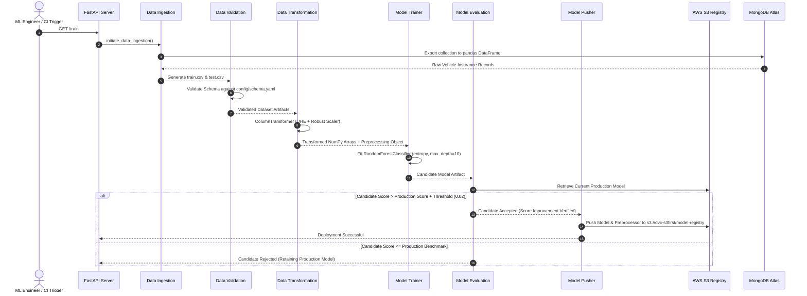

<div align="center">

# 🚗 Vehicle Insurance Prediction — Enterprise MLOps Platform
### *End-to-End Autonomous ML Pipeline, Kubernetes Orchestration & Full-Stack SRE Observability*

[](https://aws.amazon.com/eks/)
[](https://fastapi.tiangolo.com/)
[](https://www.docker.com/)
[](https://prometheus.io/)
[](https://grafana.com/)
[](https://aws.amazon.com/cloudwatch/)
[](https://www.mongodb.com/)
[](https://github.com/features/actions)

<br/>

> 🌐 **LIVE PRODUCTION APPLICATION (AWS LOAD BALANCER):**  
> ### [👉 Launch Vehicle Insurance Prediction App 👈](http://aad53e5c0982141a58fa05b3934e74a5-1227763002.us-east-1.elb.amazonaws.com/)  
> `http://aad53e5c0982141a58fa05b3934e74a5-1227763002.us-east-1.elb.amazonaws.com`

[Live App](http://aad53e5c0982141a58fa05b3934e74a5-1227763002.us-east-1.elb.amazonaws.com/) • [Health Probe](http://aad53e5c0982141a58fa05b3934e74a5-1227763002.us-east-1.elb.amazonaws.com/health) • [Readiness Probe](http://aad53e5c0982141a58fa05b3934e74a5-1227763002.us-east-1.elb.amazonaws.com/ready) • [Metrics Stream](http://aad53e5c0982141a58fa05b3934e74a5-1227763002.us-east-1.elb.amazonaws.com/metrics) • [Architecture](#-system-architecture) • [Observability](#-production-observability-stack)

</div>

---

## 📌 Executive Overview

The **Vehicle Insurance MLOps Platform** is an enterprise-grade, cloud-native machine learning solution designed to predict customer willingness to purchase additional vehicle insurance. Moving beyond isolated prototype notebooks, this project implements a resilient production architecture integrating:

- 🧠 **Autonomous MLOps Lifecycle**: Automated ingestion from MongoDB Atlas, feature engineering, distributed training, benchmark evaluation, and model promotion to an Amazon S3 Model Registry.
- ☸️ **High-Availability Kubernetes Deployment**: Deployed on **AWS EKS 1.34** across multiple worker nodes, fronted by an AWS Application Load Balancer with zero-downtime rolling updates.
- 📊 **Three-Tier SRE Observability**: Full instrumentation via Prometheus metrics scraping, customized Grafana visual dashboards, and AWS CloudWatch Container Insights + Fluent Bit log routing.
- 🛡️ **Zero-Downtime Reliability**: Kubernetes liveness and readiness probes, fine-tuned resource requests/limits, and automated alerts preventing service degradation.
- 🎨 **Modern Interactive UI**: Responsive glassmorphic frontend equipped with real-time prediction feedback and instant scenario presets.

---

## 🌐 Live AWS Production Endpoints

The application is deployed live on AWS EKS and accessible publicly via the AWS Load Balancer:

| Resource | Direct Link | Protocol & Route | Purpose |
| :--- | :--- | :--- | :--- |
| **Prediction UI** | [Launch App](http://aad53e5c0982141a58fa05b3934e74a5-1227763002.us-east-1.elb.amazonaws.com/) | `GET /` | Interactive glassmorphic prediction dashboard |
| **Health Check** | [Check Health](http://aad53e5c0982141a58fa05b3934e74a5-1227763002.us-east-1.elb.amazonaws.com/health) | `GET /health` | Kubernetes Liveness Probe (`status: healthy`) |
| **Readiness Check** | [Check Ready](http://aad53e5c0982141a58fa05b3934e74a5-1227763002.us-east-1.elb.amazonaws.com/ready) | `GET /ready` | Kubernetes Readiness Probe (`status: ready`) |
| **Prometheus Metrics** | [View Metrics](http://aad53e5c0982141a58fa05b3934e74a5-1227763002.us-east-1.elb.amazonaws.com/metrics) | `GET /metrics` | Live application telemetry & latency histograms |
| **Trigger Pipeline** | [Run Training](http://aad53e5c0982141a58fa05b3934e74a5-1227763002.us-east-1.elb.amazonaws.com/train) | `GET /train` | Triggers background data-to-model retraining |

> [!NOTE]
> **Load Balancer Hostname:**  
> `aad53e5c0982141a58fa05b3934e74a5-1227763002.us-east-1.elb.amazonaws.com`

---

## 🏛️ System Architecture

```mermaid
flowchart TD
    subgraph INGRESS [" 🌐 INGRESS & TRAFFIC LAYER "]
        Client(("👥 End Users & APIs"))
        ALB["☁️ AWS Application / Network Load Balancer"]
        K8sSvc["☸️ K8s Service: vehicle-insurance-service (Port 80 -> 5000)"]
    end

    subgraph EKS [" ⚡ AWS EKS CLUSTER: my-eks-cluster (K8s v1.34) "]
        subgraph APP_NS [" Namespace: default "]
            Pod1["📦 App Pod 1: vehicle-insurance (FastAPI)"]
            Pod2["📦 App Pod 2: vehicle-insurance (FastAPI)"]
        end

        subgraph OBS_NS [" Namespace: observability "]
            Prom["🔥 Prometheus Server (v2.48.1)"]
            Graf["📊 Grafana Visualization (v10.2.2)"]
        end

        subgraph CW_NS [" Namespace: amazon-cloudwatch "]
            CWAgent["🛡️ CloudWatch Agent DaemonSet"]
            FBit["📝 Fluent Bit Log Shipper DaemonSet"]
        end
    end

    subgraph DATA_STORAGE [" 💾 STORAGE & REGISTRY "]
        Mongo[("🍃 MongoDB Atlas (Cloud NoSQL)")]
        S3Registry[("🪣 AWS S3 Model Registry (dvc-s3first)")]
        ECR["📦 AWS ECR (685248003104.dkr.ecr.us-east-1)"]
    end

    subgraph CLOUDWATCH [" 📈 AWS CLOUDWATCH "]
        CWMetrics["📊 Container Insights (Host & Pod Metrics)"]
        CWLogs["📋 Log Groups (/aws/containerinsights/application)"]
        CWDash["🖥️ Dashboard: Vehicle-Insurance-EKS-Infrastructure"]
    end

    Client -->|HTTP:80| ALB
    ALB --> K8sSvc
    K8sSvc --> Pod1 & Pod2

    Pod1 & Pod2 <-->|Ingest Train Data| Mongo
    Pod1 & Pod2 <-->|Fetch / Push Model Artifacts| S3Registry

    Prom -->|Scrape /metrics (15s)| Pod1 & Pod2
    Prom -->|Scrape cAdvisor node metrics| EKS
    Graf -->|Query proxy :9090| Prom

    FBit -->|Ship container stdout/stderr| CWLogs
    CWAgent -->|Collect CPU/Memory utilization| CWMetrics
    CWMetrics & CWLogs --> CWDash
```

---

## 🔄 Automated MLOps Pipeline Flow

The training pipeline implements a **Champion vs. Challenger** continuous deployment pattern:



---

## 📊 Production Observability Stack

The platform features an enterprise **Site Reliability Engineering (SRE)** observability framework:

<div align="center">

```
                                  OBSERVABILITY
                                        │
                 ┌──────────────────────┼──────────────────────┐
                 │                      │                      │
                 ▼                      ▼                      ▼
         AWS CloudWatch             Prometheus          Application Logs
                 │                      │                      │
                 ▼                      ▼                      ▼
        Container Insights           Grafana            CloudWatch Logs
        (Host/Pod CPU & RAM)   (MLOps Dashboards)      (Fluent-Bit JSON)
```

</div>

### 1. Custom Application Metrics (`/metrics`)
All application telemetry is gathered and exposed via `prometheus-client`:

| Metric Name | Type | Description |
| :--- | :--- | :--- |
| `vehicle_insurance_prediction_requests_total` | Counter | Total prediction queries received (status: `success` \| `failure`) |
| `vehicle_insurance_prediction_errors_total` | Counter | Total inference runtime errors |
| `vehicle_insurance_prediction_latency_seconds` | Histogram | Inference latency across 11 buckets (`0.01s` to `10.0s`) |
| `vehicle_insurance_training_runs_total` | Counter | Total background model training executions |
| `vehicle_insurance_training_failures_total` | Counter | Total failed training pipeline runs |
| `vehicle_insurance_mongodb_errors_total` | Counter | Total database query and connection failures |
| `vehicle_insurance_http_requests_total` | Counter | HTTP requests tracked by `method`, `endpoint`, and `status_code` |

### 2. Prometheus Alerting Rules (`alerts.yaml`)
Prometheus actively evaluates 6 production rules every 15 seconds:

```yaml
groups:
  - name: vehicle-insurance-alerts
    rules:
      - alert: VehicleInsurancePodUnavailable
        expr: count(up{job="vehicle-insurance-app"} == 1) < 1
        for: 2m
        labels: { severity: critical }

      - alert: HighPredictionErrorRate
        expr: sum(rate(vehicle_insurance_prediction_errors_total[5m])) / (sum(rate(vehicle_insurance_prediction_requests_total[5m])) + 0.001) > 0.05
        for: 5m
        labels: { severity: warning }

      - alert: HighPredictionLatency
        expr: histogram_quantile(0.95, sum(rate(vehicle_insurance_prediction_latency_seconds_bucket[5m])) by (le)) > 1.0
        for: 5m
        labels: { severity: warning }

      - alert: MongoDBErrorSpike
        expr: sum(rate(vehicle_insurance_mongodb_errors_total[5m])) > 0.1
        for: 2m
        labels: { severity: critical }

      - alert: ModelTrainingFailed
        expr: increase(vehicle_insurance_training_failures_total[1h]) > 0
        for: 1m
        labels: { severity: warning }

      - alert: HighContainerMemoryUsage
        expr: sum(container_memory_working_set_bytes{container="vehicle-insurance"}) by (pod) > 1.3e+09
        for: 5m
        labels: { severity: warning }
```

### 3. Grafana MLOps Dashboard
A pre-provisioned dashboard (**Vehicle Insurance — Production Observability**) in folder **MLOps** provides:
- 📈 **Prediction Request Rate**: Live requests/sec partitioned by status.
- ⏱️ **Latency Percentiles**: Real-time P50, P95, and P99 latency graphs.
- 🔄 **Training Pipeline Tracker**: 24h count of training invocations and failure flags.
- 🌐 **HTTP Traffic Distribution**: Real-time traffic split across `/health`, `/ready`, `/`, `/predict`.
- 🍃 **MongoDB Health Monitoring**: Real-time connection and query error counter.
- 🖥️ **Pod Resource Consumption**: Active CPU usage and RAM working set against limits.

---

## 🛡️ Kubernetes Reliability & Resource Management

```yaml
# Pod Probes & Resource Limits in deployment.yaml
livenessProbe:
  httpGet:
    path: /health
    port: 5000
  initialDelaySeconds: 20
  periodSeconds: 10
  timeoutSeconds: 5
  failureThreshold: 3

readinessProbe:
  httpGet:
    path: /ready
    port: 5000
  initialDelaySeconds: 10
  periodSeconds: 5
  timeoutSeconds: 3
  failureThreshold: 2

resources:
  requests:
    cpu: "250m"
    memory: "512Mi"
  limits:
    cpu: "1000m"
    memory: "1.5Gi"
```

- **Liveness Probe (`/health`)**: *"Should Kubernetes restart this container?"* Automatically restarts deadlocked or unresponsive containers.
- **Readiness Probe (`/ready`)**: *"Should Kubernetes route traffic to this pod?"* Ensures no user request hits a pod before its machine learning model is loaded into memory.
- **Resource Constraints**: Guarantees dedicated CPU/memory to each pod while preventing runaway memory spikes from impacting other workloads.

---

## 🛠️ Complete Tech Stack

| Layer | Tools & Frameworks | Highlights |
| :--- | :--- | :--- |
| **Core ML Engine** | `scikit-learn`, `NumPy`, `Pandas`, `Dill` | Random Forest Classifier, custom preprocessing pipeline |
| **API & Backend** | `FastAPI`, `Uvicorn`, `Pydantic`, `Starlette` | Asynchronous REST endpoints, ASGI Prometheus middleware |
| **Database** | `MongoDB Atlas`, `PyMongo` | Cloud NoSQL raw data repository |
| **Cloud Infrastructure** | `AWS EKS`, `AWS ECR`, `AWS S3`, `AWS ALB` | Kubernetes 1.34 cluster, container registry, model store |
| **Containerization** | `Docker`, `Docker Compose` | Lean multi-stage image builds |
| **Observability** | `Prometheus`, `Grafana`, `CloudWatch Container Insights` | Metric scraping, alerting, visualization, log aggregation |
| **CI / CD Pipeline** | `GitHub Actions`, `Pytest`, `AWS OIDC` | Automated unit tests, image packaging, zero-downtime rollouts |

---

## 🚀 Quickstart & Local Setup

### 1. Prerequisites
- Python 3.10+
- Docker (optional for containerized run)
- AWS CLI configured with S3 access
- MongoDB Atlas connection string

### 2. Clone Repository & Setup Virtualenv
```bash
git clone https://github.com/Ishaan-Chaturved1/Vehicle-Insurance-Domain.git
cd Vehicle-Insurance-Domain

# Create virtual environment
python -m venv venv

# Activate virtual environment
# Windows (PowerShell):
.\venv\Scripts\Activate.ps1
# Linux / macOS:
source venv/bin/activate

# Install dependencies
pip install -r requirements.txt
```

### 3. Set Environment Variables
```bash
# Windows PowerShell:
$env:MONGODB_URL="mongodb+srv://<user>:<password>@cluster.mongodb.net/?retryWrites=true&w=majority"
$env:AWS_ACCESS_KEY_ID="your_key"
$env:AWS_SECRET_ACCESS_KEY="your_secret"
$env:AWS_DEFAULT_REGION="us-east-1"

# Linux / macOS:
export MONGODB_URL="mongodb+srv://<user>:<password>@cluster.mongodb.net/?retryWrites=true&w=majority"
export AWS_ACCESS_KEY_ID="your_key"
export AWS_SECRET_ACCESS_KEY="your_secret"
export AWS_DEFAULT_REGION="us-east-1"
```

### 4. Execute Test Suite
```bash
pytest -v
```
```text
tests/test_basics.py::test_constants PASSED                               [ 10%]
tests/test_basics.py::test_vehicle_data_to_dataframe PASSED               [ 20%]
tests/test_basics.py::test_fastapi_app_instance PASSED                    [ 30%]
tests/test_observability.py::test_health_endpoint PASSED                  [ 40%]
tests/test_observability.py::test_ready_endpoint PASSED                   [ 50%]
tests/test_observability.py::test_metrics_endpoint_and_content PASSED     [ 60%]
tests/test_observability.py::test_prediction_metrics_increment PASSED     [ 70%]
tests/test_observability.py::test_prediction_error_metric_increment PASSED [ 80%]
tests/test_observability.py::test_training_metrics_increment PASSED       [ 90%]
tests/test_observability.py::test_mongodb_error_metric PASSED             [100%]
============================== 10 passed in 10.82s ==============================
```

### 5. Launch Application Locally
```bash
python app.py
```
Open **http://localhost:5000** in your browser.

---

## 🐳 Docker Deployment

```bash
# Build the Docker image
docker build -t vehicle-insurance:latest .

# Run container with injected environment
docker run -p 5000:5000 \
  -e MONGODB_URL="${MONGODB_URL}" \
  -e AWS_ACCESS_KEY_ID="${AWS_ACCESS_KEY_ID}" \
  -e AWS_SECRET_ACCESS_KEY="${AWS_SECRET_ACCESS_KEY}" \
  -e AWS_DEFAULT_REGION="us-east-1" \
  vehicle-insurance:latest
```

---

## ☸️ Accessing In-Cluster Observability

You can securely inspect the in-cluster Prometheus and Grafana dashboards via port forwarding:

```bash
# 1. Grafana Dashboard (Credentials: admin / admin321)
kubectl port-forward svc/grafana 3000:3000 -n observability
# Open http://localhost:3000 in your browser

# 2. Prometheus Dashboard
kubectl port-forward svc/prometheus 9090:9090 -n observability
# Open http://localhost:9090 in your browser
```

---

## 🔄 CI/CD Production Pipeline

Every push to `main` triggers a complete automated release cycle:

```text
git push origin main
       ↓
GitHub Actions Runner
       ↓
Run Pytest (10/10 Tests Passed)
       ↓
Authenticate AWS OIDC
       ↓
Docker Build & Tag Image
       ↓
Push to Amazon ECR
       ↓
Apply Kubernetes Manifests to AWS EKS
       ↓
Zero-Downtime Rolling Update & Rollout Verification
```

---

## 👤 Author & Maintainer

**Ishaan Chaturvedi**  
- **GitHub:** [@Ishaan-Chaturved1](https://github.com/Ishaan-Chaturved1)  
- **Repository:** [Vehicle-Insurance-Domain](https://github.com/Ishaan-Chaturved1/Vehicle-Insurance-Domain)

---

<div align="center">

⭐ **If you find this project useful, please star the repository!** ⭐

<sub>Engineered with precision for resilient, real-world MLOps.</sub>

</div>