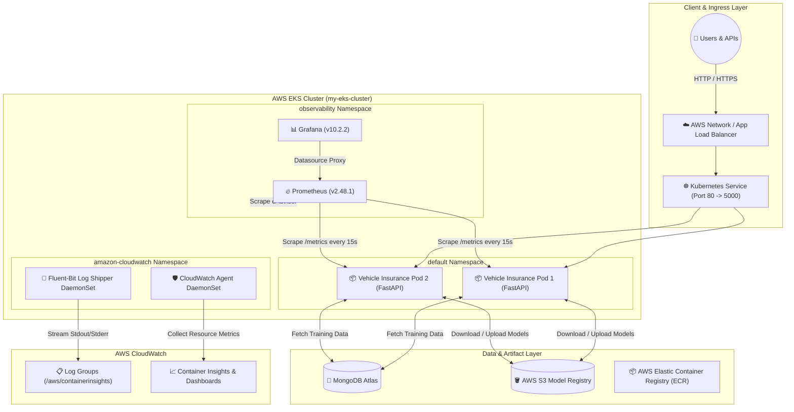
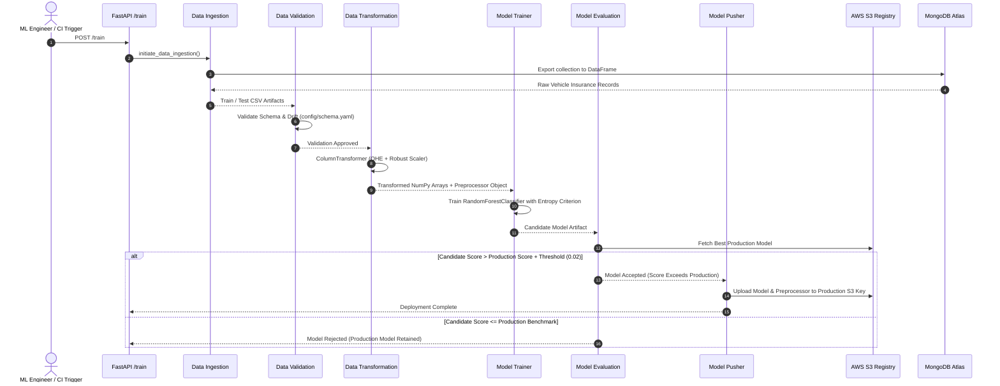

# 🚗 Vehicle Insurance Prediction — Enterprise MLOps Platform

<div align="center">

[](https://www.python.org/)
[](https://fastapi.tiangolo.com/)
[](https://aws.amazon.com/)
[](https://kubernetes.io/)
[](https://www.docker.com/)
[](https://prometheus.io/)
[](https://grafana.com/)
[](https://github.com/features/actions)
[](LICENSE)

<br/>

**A production-ready, end-to-end Machine Learning Operations (MLOps) platform predicting customer vehicle insurance purchase intent — featuring automated pipelines, zero-downtime AWS EKS deployment, automated model registry on S3, and full-stack enterprise observability.**

[Explore Architecture](#-system-architecture) • [Observability Stack](#-production-observability-stack) • [Quickstart](#-quickstart--local-development) • [API Reference](#-api-endpoints)

</div>

---

## 🌟 Executive Summary

This project showcases a complete industrial-grade MLOps system that bridges data science and site reliability engineering (SRE). Rather than stopping at a Jupyter Notebook or a simple Flask script, this solution implements:

1. **Automated ML Lifecycle**: Continuous data ingestion from MongoDB Atlas, schema validation, scikit-learn preprocessing pipelines, automated model evaluation against live S3 model registry benchmarks, and model artifact pushing.
2. **Resilient Microservice Backend**: High-performance FastAPI server serving asynchronous batch/single inference and pipeline orchestration endpoints.
3. **Enterprise Kubernetes Deployment**: Cloud-native deployment on **AWS EKS 1.34** fronted by an AWS Application Load Balancer with automated health probes (liveness, readiness), graceful terminations, and granular resource quotas.
4. **Three-Tier Observability Stack**:
   - **Prometheus**: Custom Prometheus metrics (prediction counters, latency histograms, training status, DB error tracking) + cAdvisor metrics.
   - **Grafana**: Pre-provisioned dashboards visualizing request throughput, P50/P95/P99 latency, container metrics, and error rates.
   - **AWS CloudWatch Container Insights**: Host/Pod CPU and Memory metrics, Fluent Bit log aggregation, and real-time container log analysis.
5. **Modern Glassmorphic UI**: Ultra-responsive, interactive client interface with real-time prediction feedback and quick sample presets.

---

## 🏛️ System Architecture



---

## 🔄 End-to-End MLOps Pipeline Flow



---

## 🛠️ Technology Stack

| Domain | Technologies | Purpose |
| :--- | :--- | :--- |
| **Language & Runtime** | `Python 3.10 / 3.13`, `Uvicorn`, `ASGI` | Core application and pipeline environment |
| **Machine Learning** | `scikit-learn`, `numpy`, `pandas`, `dill` | Feature pipelines, Random Forest training & serialization |
| **Web Framework** | `FastAPI`, `Jinja2`, `Pydantic` | Async prediction APIs and interactive web interface |
| **Database** | `MongoDB Atlas` | Cloud-hosted NoSQL store for raw training records |
| **Containerization** | `Docker` | Multi-stage, reproducible microservice container builds |
| **Cloud Infrastructure** | `AWS EKS 1.34`, `EC2 (t3.medium)`, `S3`, `ECR` | Highly scalable Kubernetes cluster, model registry & image repo |
| **CI / CD** | `GitHub Actions`, `Pytest`, `AWS OIDC` | Automated unit tests, container builds, and rolling cluster deployments |
| **Metrics & Observability** | `Prometheus`, `Grafana`, `prometheus-client` | Real-time metric scraping, latency monitoring, dashboard provision |
| **Logging & Tracing** | `AWS CloudWatch`, `Fluent-Bit`, `OpenTelemetry` | Centralized log streaming and Container Insights host monitoring |

---

## 📁 Repository Directory Structure

```plaintext
├── .github/
│   └── workflows/
│       └── ci-cd.yaml             # GitHub Actions automated build, test & deploy pipeline
├── config/
│   ├── model.yaml                 # RandomForest hyperparameters & evaluation thresholds
│   └── schema.yaml                # Feature schema definitions (numerical, categorical, drop)
├── k8s/
│   └── observability/
│       ├── alerts.yaml            # Prometheus AlertRules (Error rate, latency, MongoDB, OOM)
│       ├── cloudwatch-dashboard.json # CloudWatch Container Insights infrastructure dashboard
│       ├── grafana.yaml           # Grafana Deployment, Service & Provisioned MLOps Dashboard
│       └── prometheus.yaml        # Prometheus RBAC, ConfigMap, Deployment & Service
├── notebook/
│   ├── data.csv                   # Raw training dataset benchmark
│   └── mongoDB_demo.ipynb         # Data export and MongoDB Atlas connectivity notebook
├── src/
│   ├── cloud_storage/
│   │   └── aws_storage.py         # S3 bucket read/write, model upload/download utility
│   ├── components/
│   │   ├── data_ingestion.py      # Extract data from MongoDB into train/test sets
│   │   ├── data_validation.py     # Schema validation and data drift detection
│   │   ├── data_transformation.py # Preprocessing pipeline (OneHotEncoder, MinMaxScaler)
│   │   ├── model_trainer.py       # Random Forest model training and score evaluation
│   │   ├── model_evaluation.py    # Champion vs. Challenger model evaluation on S3
│   │   └── model_pusher.py        # Promotes accepted models into S3 production registry
│   ├── configuration/
│   │   ├── aws_connection.py      # Boto3 S3 client connection manager
│   │   └── mongo_db_connection.py # PyMongo connection manager with metric error tracking
│   ├── constants/                 # Centralized pipeline configurations and paths
│   ├── entity/                    # Config entity and artifact entity dataclasses
│   ├── observability/
│   │   └── metrics.py             # Custom Prometheus Counters, Histograms, ASGI middleware
│   ├── pipline/
│   │   ├── prediction_pipeline.py # Production prediction pipeline from S3 model
│   │   └── training_pipeline.py   # Full training pipeline orchestrator
│   └── utils/
│       └── main_utils.py          # YAML, pickle, and numpy serialization utilities
├── static/
│   └── css/
│       └── style.css              # Modern glassmorphism UI styles
├── templates/
│   └── vehicledata.html           # Interactive HTML frontend with presets and dynamic controls
├── tests/
│   ├── test_basics.py             # Fundamental data conversion and FastAPI app tests
│   └── test_observability.py      # /health, /ready, /metrics, latency, and counter test suite
├── app.py                         # FastAPI web server entrypoint with observability endpoints
├── deployment.yaml                # Kubernetes deployment with health probes and resource limits
├── service.yaml                   # Kubernetes LoadBalancer service definition
├── Dockerfile                     # Multi-stage Docker build recipe
├── requirements.txt               # Application dependencies
└── OBSERVABILITY.md               # Complete enterprise observability runbook
```

---

## 📈 Production Observability Stack

The system incorporates full SRE-grade observability to guarantee zero blind spots:

```
                                  OBSERVABILITY
                                        │
                 ┌──────────────────────┼──────────────────────┐
                 │                      │                      │
                 ▼                      ▼                      ▼
         AWS CloudWatch             Prometheus          Application Logs
                 │                      │                      │
                 ▼                      ▼                      ▼
        Container Insights           Grafana            CloudWatch Logs
        (Host/Pod CPU & RAM)   (MLOps Dashboards)      (Fluent-Bit JSON)
```

### 1. Prometheus Application Metrics (`/metrics`)
All application metrics are exposed in Prometheus text format at `/metrics` via `prometheus-client`:

- **`vehicle_insurance_prediction_requests_total`**: Counter tracking total prediction queries (labeled by `status=success|failure`).
- **`vehicle_insurance_prediction_errors_total`**: Counter tracking total inference failures.
- **`vehicle_insurance_prediction_latency_seconds`**: High-resolution Histogram observing inference execution time across 11 buckets (`0.01s` to `10.0s`).
- **`vehicle_insurance_training_runs_total`**: Counter tracking total `/train` executions.
- **`vehicle_insurance_training_failures_total`**: Counter tracking pipeline training failures.
- **`vehicle_insurance_mongodb_errors_total`**: Counter capturing MongoDB Atlas connectivity and query errors.
- **`vehicle_insurance_http_requests_total`**: HTTP request counter partitioned by method, endpoint, and status code.

### 2. Pre-Configured Alerting Rules (`alerts.yaml`)
Prometheus actively evaluates 6 production alert rules:
1. `VehicleInsurancePodUnavailable`: Triggers if active pods drop below 1 for > 2 min.
2. `HighPredictionErrorRate`: Triggers if prediction error rate exceeds 5% over 5 min.
3. `HighPredictionLatency`: Triggers if P95 latency exceeds 1.0 second.
4. `MongoDBErrorSpike`: Triggers if MongoDB query/connection failures spike.
5. `ModelTrainingFailed`: Triggers if any `/train` execution terminates with an error.
6. `HighContainerMemoryUsage`: Triggers if pod memory usage exceeds 85% of its limit.

### 3. Grafana Enterprise Dashboard
A pre-provisioned dashboard located in the **MLOps** folder presents:
- **Prediction Request Rate**: Live throughput per status.
- **Inference Latency Percentiles**: P50, P95, and P99 latency tracking.
- **Model Training Runs & Failures**: 24-hour training success and failure cards.
- **HTTP Request Volume by Endpoint**: Distribution of `/health`, `/ready`, `/predict`, `/train`.
- **Database Health**: Real-time MongoDB error count.
- **Resource Utilization**: Container CPU & Working Set Memory vs. Kubernetes Limits.

---

## 🚦 Kubernetes Health Probes & Reliability

The Kubernetes deployment (`deployment.yaml`) enforces production-safe orchestration:

```yaml
livenessProbe:
  httpGet:
    path: /health
    port: 5000
  initialDelaySeconds: 20
  periodSeconds: 10
  timeoutSeconds: 5
  failureThreshold: 3

readinessProbe:
  httpGet:
    path: /ready
    port: 5000
  initialDelaySeconds: 10
  periodSeconds: 5
  timeoutSeconds: 3
  failureThreshold: 2

resources:
  requests:
    cpu: "250m"
    memory: "512Mi"
  limits:
    cpu: "1000m"
    memory: "1.5Gi"
```

- **Liveness Probe (`/health`)**: Asks *"Is the container alive?"* If the process deadlocks, Kubernetes restarts the pod.
- **Readiness Probe (`/ready`)**: Asks *"Is the application ready to handle user traffic?"* Ensures traffic is only routed after models and dependencies are loaded into memory.
- **Resource Limits**: Prevents noisy-neighbor OOM crashes while guaranteeing baseline CPU and memory allocations.

---

## ⚡ API Endpoints

| Method | Endpoint | Description | Sample Response |
| :--- | :--- | :--- | :--- |
| `GET` | `/` | Web UI Interactive Prediction Dashboard | `HTML Form` |
| `POST` | `/` | Form submission endpoint for single prediction | `HTML with Prediction Badge` |
| `GET` | `/health` | Kubernetes Liveness Probe endpoint | `{"status":"healthy","service":"vehicle-insurance"}` |
| `GET` | `/ready` | Kubernetes Readiness Probe endpoint | `{"status":"ready","model_loaded":true}` |
| `GET` | `/metrics` | Prometheus Metrics Scrape endpoint | `Prometheus Exporter Format` |
| `GET` | `/train` | Triggers background model training pipeline | `{"message":"Training pipeline completed successfully"}` |

---

## 🚀 Quickstart & Local Development

### Prerequisites
- Python 3.10+
- Docker & Docker Compose (optional)
- AWS CLI configured with S3 permissions
- MongoDB Atlas cluster URI

### 1. Clone & Set Up Environment
```bash
# Clone the repository
git clone https://github.com/Ishaan-Chaturved1/Vehicle-Insurance-Domain.git
cd Vehicle-Insurance-Domain

# Create and activate virtual environment
python -m venv venv
# On Windows:
.\venv\Scripts\Activate.ps1
# On Linux/macOS:
source venv/bin/activate

# Install dependencies
pip install -r requirements.txt
```

### 2. Configure Environment Variables
Create a `.env` file or export your credentials:
```bash
export MONGODB_URL="mongodb+srv://<user>:<password>@cluster.mongodb.net/?retryWrites=true&w=majority"
export AWS_ACCESS_KEY_ID="your_aws_key_id"
export AWS_SECRET_ACCESS_KEY="your_aws_secret_key"
export AWS_DEFAULT_REGION="us-east-1"
```

### 3. Run Test Suite
Verify that all unit and observability tests pass:
```bash
pytest -v
```
Output:
```text
tests/test_basics.py::test_constants PASSED                               [ 10%]
tests/test_basics.py::test_vehicle_data_to_dataframe PASSED               [ 20%]
tests/test_basics.py::test_fastapi_app_instance PASSED                    [ 30%]
tests/test_observability.py::test_health_endpoint PASSED                  [ 40%]
tests/test_observability.py::test_ready_endpoint PASSED                   [ 50%]
tests/test_observability.py::test_metrics_endpoint_and_content PASSED     [ 60%]
tests/test_observability.py::test_prediction_metrics_increment PASSED     [ 70%]
tests/test_observability.py::test_prediction_error_metric_increment PASSED [ 80%]
tests/test_observability.py::test_training_metrics_increment PASSED       [ 90%]
tests/test_observability.py::test_mongodb_error_metric PASSED             [100%]
============================== 10 passed in 10.82s ==============================
```

### 4. Start the Application Locally
```bash
python app.py
```
Visit `http://localhost:5000` in your browser.

---

## 🐳 Running with Docker

```bash
# Build the Docker image
docker build -t vehicle-insurance:latest .

# Run container with environment variables
docker run -p 5000:5000 \
  -e MONGODB_URL="${MONGODB_URL}" \
  -e AWS_ACCESS_KEY_ID="${AWS_ACCESS_KEY_ID}" \
  -e AWS_SECRET_ACCESS_KEY="${AWS_SECRET_ACCESS_KEY}" \
  -e AWS_DEFAULT_REGION="us-east-1" \
  vehicle-insurance:latest
```

---

## ☸️ Kubernetes & Observability Access

To view the in-cluster monitoring dashboards:

```bash
# Forward Grafana to localhost:3000
kubectl port-forward svc/grafana 3000:3000 -n observability
# Credentials -> Username: admin | Password: admin321

# Forward Prometheus to localhost:9090
kubectl port-forward svc/prometheus 9090:9090 -n observability

# Forward Application directly (if not using LoadBalancer)
kubectl port-forward svc/vehicle-insurance-service 5000:80 -n default
```

---

## 🔄 CI/CD Automation Flow

The repository utilizes **GitHub Actions** (`.github/workflows/ci-cd.yaml`) to automate production releases:

1. **Continuous Integration (CI)**:
   - Lint checks and executes the `pytest` test suite.
   - Code changes are validated before any build step runs.
2. **Containerization & Registry Push**:
   - Securely assumes AWS IAM role via **AWS OIDC**.
   - Builds multi-platform Docker image.
   - Pushes version-tagged and `latest` images to **Amazon ECR**.
3. **Continuous Deployment (CD)**:
   - Connects to AWS EKS cluster (`my-eks-cluster`).
   - Executes rolling deployment updates using `kubectl apply -f deployment.yaml`.
   - Verifies rollout status using `kubectl rollout status deployment/vehicle-insurance`.

---

## 👥 Author & Acknowledgements

Developed by **[Ishaan Chaturvedi](https://github.com/Ishaan-Chaturved1)**  
Feedback, contributions, and stars are always welcome! ⭐

---

<div align="center">
<sub>Built with precision for enterprise machine learning operations.</sub>
</div>